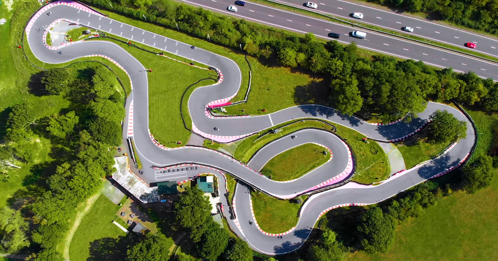
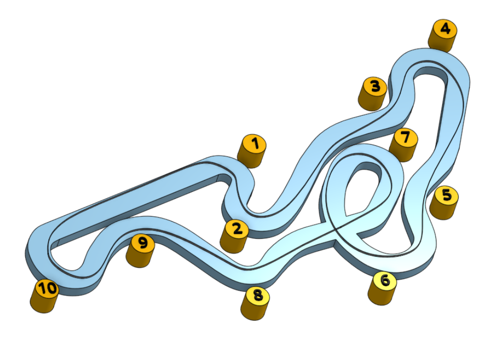

# Brighton

Brighton is fast, small circuit located in the south of England run by QLeisure. Visit the [track website here](https://www.brightonkarting.co.uk/).

Plan your journey [here](https://www.google.com/maps/place/QLeisure/@50.9229007,-0.1974463,17z/data=!3m1!4b1!4m5!3m4!1s0x4875921dada7ec4b:0xa2c095f7b5f0dff4!8m2!3d50.9228973!4d-0.1952576).

Here's an example of the driving line, distilled from a [video review of the circuit](https://youtu.be/Kju8yiZ_y14?t=165):

## Tips (for a dry day)
* This is a fast course. As you develop confidence on the circuit, you will find you don't need to brake at corners 3, 5, 8, or 9.
* With practice, you may be able to reduce use of the brake pedal to corners 1, 4, 7, and 10.
* The longest 'straight' is from corner 7 to corner 10. The earlier you start the straight, the faster you will be by the end. Corners 8 and 9 can be taken flat out.
* Keep momentum as high as possible. Sodi karts will bog down at low speeds.
* While the starting grid is on the straight leading to turn 1, the finish line is just after turn 2.
* Be careful into turn 6. There's a drainage grate in the chevrons on the inside of the turn that you really don't want to hit. Either straddle it or avoid it completely.
* At the start of the race here, the karts are on the starting line just before turn 1. In the distance, at the finish line just after turn 2, a red light switches to green to signal the start of the race. No overtaking until you cross the finish line.
* Use the run-off areas at turns 2, 4 and 7 to drive a straighter line and hold on to momentum. Oversteering to try to keep completely on the track can slow the kart down.
* At corner 10 you can get back on the power quite early as there's a large run off area exiting corner 10 onto the straight.

## Timing

* In 2021, the event was scheduled to start at 12:45. Competitors fought for a place in the A or B group and we had two races for A and two races for B; 5 mins practice to qualify and two 20 minute races. Races finished around 4 o'clock and everyone had left the venue by around 4:30.

## On-Board Video

### 2021
Chris O - [A group race 1](https://www.youtube.com/watch?v=_lYWWRLwOHY)

Chris O - [A group race 2](https://www.youtube.com/watch?v=5tBRfbytF2k)

Adam C - [B group race 1](https://www.youtube.com/watch?v=d8OkyZRE4b4)

Simon S - [A group race 1](https://www.youtube.com/watch?v=KPEkHYeyvbI&feature=youtu.be)

Simon S - [A group race 2](https://www.youtube.com/watch?v=W5Tmz3Pdau0)

Arwel O - [A group race 1](https://www.youtube.com/watch?v=IPi_xFaeBFw)

Chris T - [A group race 2](https://www.youtube.com/watch?v=qRG9n8679Z4)

## Club Records

| Weather | Beginner | Intermediate | Advanced |
|---      |---       |---           |---       |
| Dry     | Karl Anderson ( 44.191 - 2021 ) | Jack Merry ( 43.880 - 2021 ) | Chris Orritt ( 43.436 - 2021 ) |
| Wet     |          |              |          |
