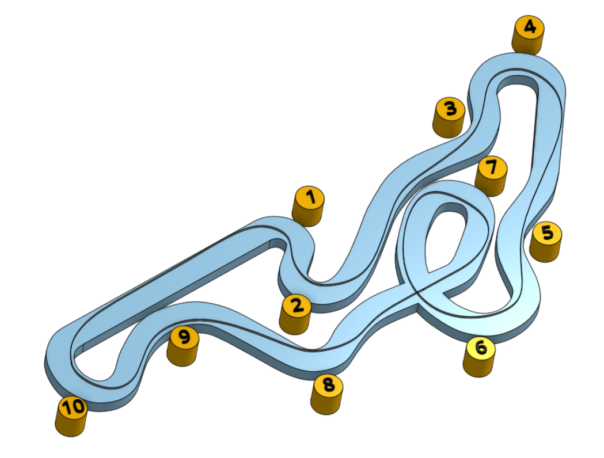

# Brighton

Brighton is fast, small circuit located in the south of England run by QLeisure. Visit the [track website here](https://www.brightonkarting.co.uk/).

Plan your journey [here](https://www.google.com/maps/place/QLeisure/@50.9229007,-0.1974463,17z/data=!3m1!4b1!4m5!3m4!1s0x4875921dada7ec4b:0xa2c095f7b5f0dff4!8m2!3d50.9228973!4d-0.1952576).

Here's an example of the driving line, distilled from a [video review of the circuit](https://youtu.be/Kju8yiZ_y14?t=165):

## Tips (for a dry day)
* This is a fast course. As you develop confidence on the circuit, you will find you don't need to brake at corners 3, 5, 8, or 9.
* With practice, you may be able to reduce use of the brake pedal to corners 1, 4, 7, and 10.
* The longest 'straight' is from corner 7 to corner 10. The earlier you start the straight, the faster you will be by the end. Corners 8 and 9 can be taken flat out.
* Keep momentum as high as possible. Sodi karts will bog down at low speeds.
* While the starting grid is on the straight leading to turn 1, the finish line is just after turn 2.
* Be careful into turn 6. There's a drainage grate in the chevrons on the inside of the turn that you really don't want to hit.
