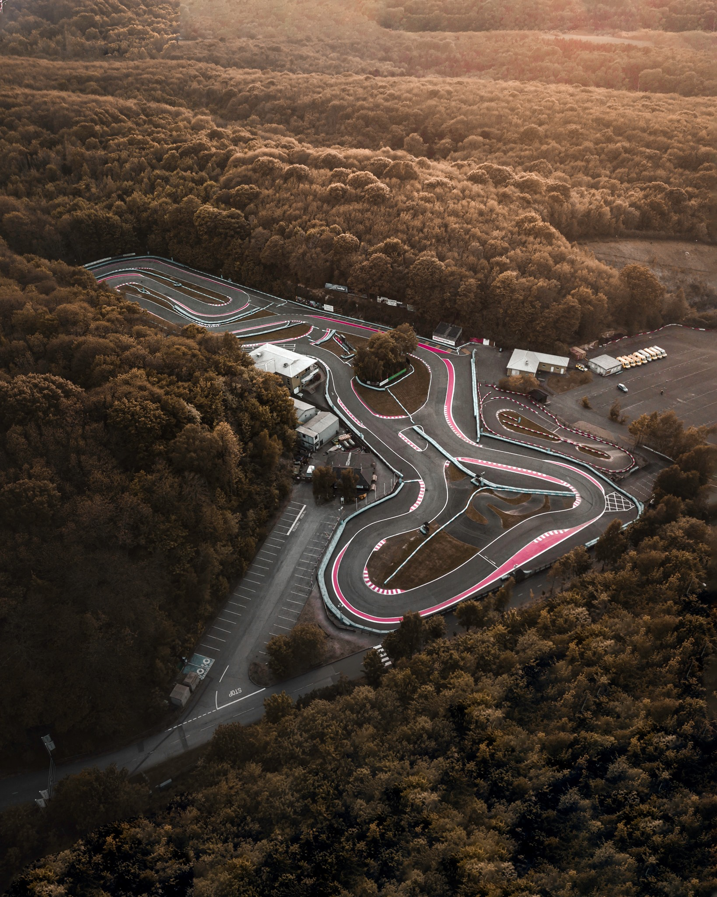
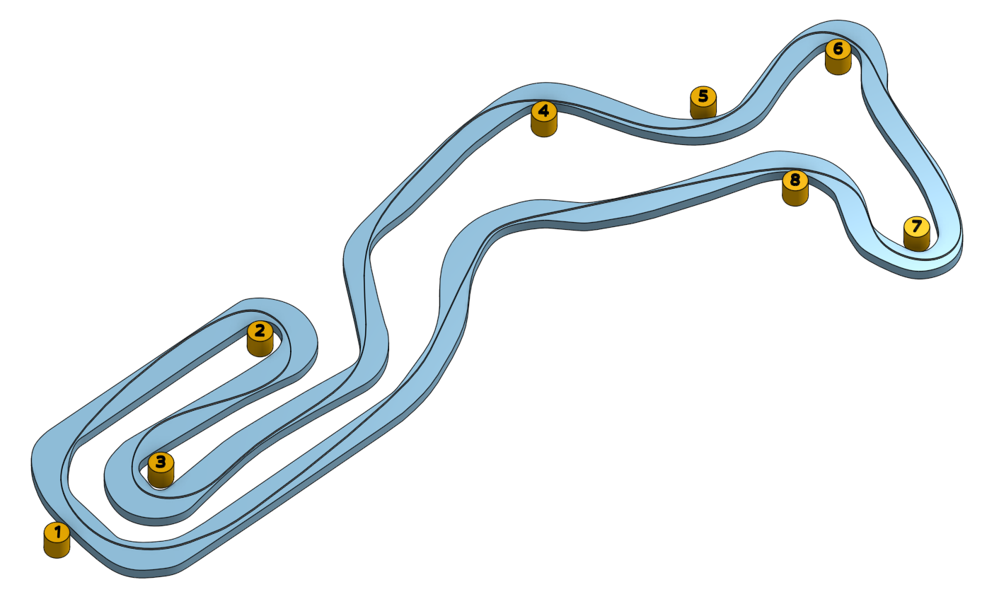

# Buckmore Park

Buckmore Park started out in the 1960s and has undergone many changes over the years. Today it's considered one of the best karting circuits in the country. Visit the [track website here](https://www.buckmore.co.uk/).

## Club Etiquette

Please [click here](../Club_Eiquette) refresh yourself on club etiquette. As with the safety video, you should give the club etiquette a review before every race.

## Getting There

Plan your journey [here](https://www.google.com/maps/place/Buckmore+Park+Kart+Circuit/@51.3403033,0.4986345,1227m/data=!3m1!1e3!4m6!3m5!1s0x47df333258701513:0x27bc7cc3da5517ab!8m2!3d51.343279!4d0.501862!16zL20vMGJrNnI1?entry=ttu). The postcode is ME5 9QG, or if you're more into W3W, they give their address as [bravo.driver.usage](https://what3words.com/bravo.driver.usage), which seems quite fitting for a karting circuit.

## Driving Line

Here's an example driving line:

## Video

Buckmore's rules on Go Pros are that they cannot be helmet or chest mounted. The karts apparently have mount points, so you should be able to just lock and load. Alternatively, apparently shoulder mounts are also OK. Here's a [video](https://www.youtube.com/watch?v=JcXdOtnbK1k&t=152s) the combines a trip round the track with plenty of driving tips.

## Driving Tips

We couldn't find a nicely written set of tips in one place for this court. There are plenty of tips in the video above, and there's also another [video](https://www.youtube.com/watch?v=nyD9dJcFuyg) from SuperGT offering some tips you might find useful.

## Club Records

| Weather | Beginner | Intermediate | Advanced |
|---      |---       |---           |---       |
| Dry     |  |
| Wet     |          |              |          |
