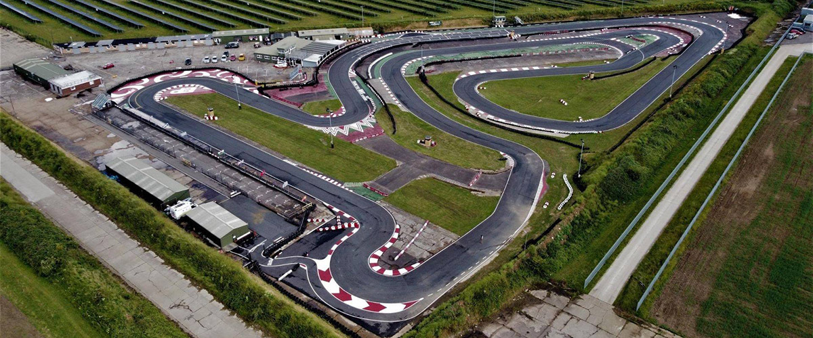

# Ellough Park

Ellough Park is one of the premier circuits in the country. When you park up here, you'll likely see trucks here that carried private karts. We'll be using the hire karts though. Visit the [track website here](http://www.elloughpark.co.uk/).

## Getting There

Plan your journey [here](https://www.google.com/maps/place/Ellough+Park+Kart+Circuit/@52.4351371,1.6018921,17.5z/data=!4m13!1m7!3m6!1s0x47da1e7516df2eb3:0x47cbc48f7c3dfc3a!2sBeccles+NR34+7XD,+UK!3b1!8m2!3d52.4351306!4d1.6021515!3m4!1s0x47d9f60e3c2ec8ef:0x156dce0dbaf4d6a0!8m2!3d52.4347496!4d1.6016709?hl=en-US).

## Driving Line

Here's an example driving line:

## Video

Go Pros are no-go at Ellough. Here's a [video](https://www.youtube.com/watch?v=bN9HLw7i2DU) to give you a feel for the track though.

## Driving Tips

If you want to dive into more expert guidance, check out the [Club 100 Track Guide](https://club100.co.uk/circuit-guide/ellough-park-bite-size-track-guide/)

## Club Records

| Weather | Beginner | Intermediate | Advanced |
|---      |---       |---           |---       |
| Dry     | Giles Foster-Hall ( 56.078 - 2019) | Ross Corkett ( 55.188 - 2019 ) | Kevin Allen ( 53.524 - 2019 ) |
| Wet     |          |              |          |
