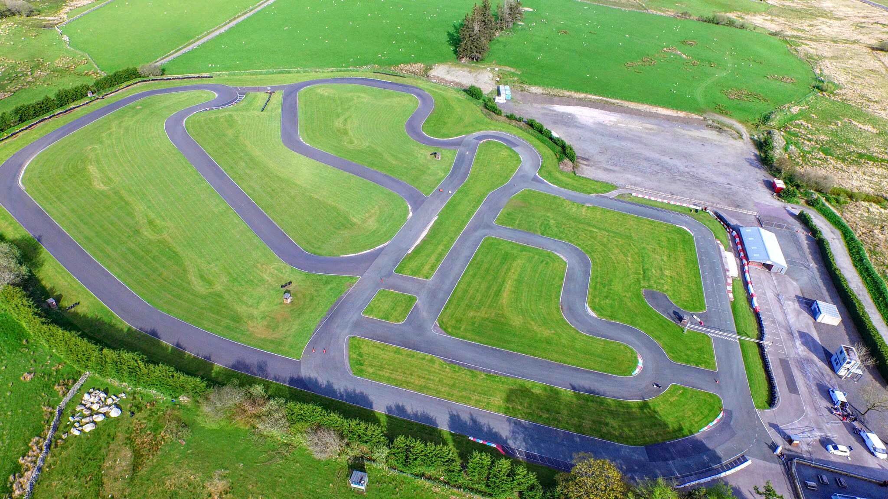
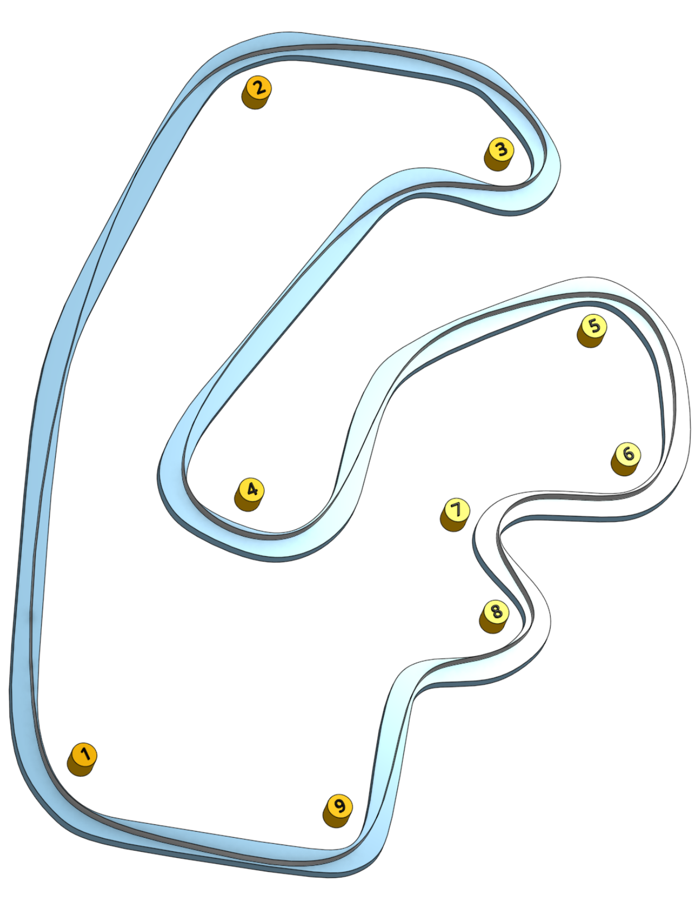

# GYG

In the picturesque hills of North Wales lies the track Red Bull ranked the best in the UK back in 2018. GYG is characterised by its mixture of fast, flowing corners, a tricky final sector and massive elevation change over the lap. This 1,100m circuit is a great mix of flat out & tight technical sections. 

The standout features of GYG are the very long uphill Dragon Straight followed by the ultra-fast turn three, a compression complex consisting of ever-tightening right-hand corners. Finally, there’s the Devil’s Elbow in the last sector where the track drops away dramatically.

Visit the [track website here](https://gygkarting.com/).

## Club Etiquette

Please [click here](../Club_Eiquette) refresh yourself on club etiquette. As with the safety video, you should give the club etiquette a review before every race.

## Getting There

Postcode - LL21 0RU

Plan your journey [here](https://www.google.com/maps/place/GYG+KARTING+LTD/@53.0347665,-3.5866792,17z/data=!3m1!4b1!4m5!3m4!1s0x486538d5b383ed39:0xda8bc09c1439c1bc!8m2!3d53.0347633!4d-3.5844905).

## Driving Line

Here's an example driving line:

## Video

You can watch a nice clean lap driven by Arwel by [clicking here](https://youtu.be/Qgcq67cqzwo?t=1349)

## Driving Tips

* While the majority of this track can be driven flat, it has a technical section at the end where you can lose or make up a lot of time.

* Turn 1 (Club corner) is flat out. Stay tight to the apex & you can use the run off on the exit to carry your speed on to the long straight if needed.

* Turn 2 is a kink to the right flat out.

* Turn 3 (The spoon) and turn 4. This section is one of the best overtaking spots on the track (take care on the 1st lap as this will be the first braking point after a long flat out section). You’ll approach this corner over a crest & the track will immediately bend to the right. Stay to the left of the track and try to hit the apex late on so that you’re flat for the left part of the corner and on to the back straight. Sticking to the racing line through the spoon corner will leave you vulnerable to overtakes so be careful.

* Turn 4 (The carousel). You’ll only need a quick dab of the break here before you turn in. This is a double apex corner and you’ll need to stay tight to the left the whole way through. Try not to drift out to the right here as you could lose a lot of time and speed going into a long flat out section.

* Turn 5 and 6. This is a double right hander. As you gain confidence and the kart warms up, you’ll be able to go flat through all of this. Take care through turn 6 however as you’ll need to stay tight to the right ahead of the next left hander.

* Turn 7 (Compression corner). If you’ve got the previous corner correct, you should be towards the right side of the track. As soon as you straighten out you’ll need to be on the breaks ready for this corner. Try not to drift too far to the right on exit as this will compromise the next right hander.

* Turn 8 (Devil's elbow). This is the last braking zone on the track until turn 3 (The spoon) so make sure you get this right. Much like some of the previous corners, you’ll need to stay tight to the apex on the exit of the corner. Try not to take too much of the kerb as it tends to throw you out to the left of the track if you hit too much of it.

* Turn 9 (Paddock bend). Careful not to go too close to the kerb as there’s a dip there that will unsettle your kart. Instead, aim to apex the corner on the very edge of the dip. You can use the run off on exit if needed & it won’t cost you any time (although it will be a bit bumpy).

* If it’s wet, you’ll need to take care in the following corners:
    * Turn 1 (Club corner) - You’ll need to brake. Turn in early and stay on the darker part of the tarmac. 
    * Turn 2 - Like turn 1, this is no longer flat (depending on the level of rain). As the track dries out, you can gain a lot of time here by just lifting & eventually back to being flat.
    * Turn 4 (The carousel) - It’s very easy to drift right here, especially in the wet. Break early to avoid the standing puddles on the right that will slow you right down & possibly spin you out.
    * Turn 5 and 6 (The double right handers) - Break before turning in to turn 5 and then again as you approach the apex of turn 6
    * Turn 9 (Paddock bend) - This can be a very frustrating corner in the wet as you have to slow down way more than you expect. The kart will struggle to turn otherwise and you’ll end up drifting over the run off on exit. Instead, slow right down then turn in. You can use the dip near the apex here to help turn the kart a little.

## Club Records

| Weather | Beginner | Intermediate | Advanced |
|---      |---       |---           |---       |
| Dry     | Ali Tommis ( 59:927 - 2022 )         | Mark Hopkins ( 57:250 - 2022 )             | Daniel Skelton ( 56:682 - 2022 )         |