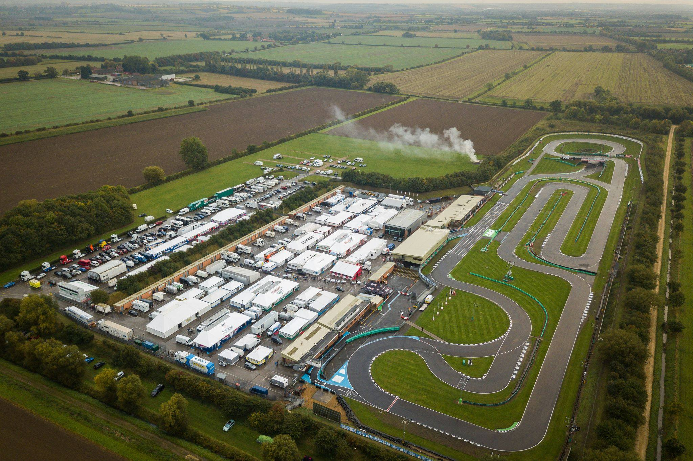
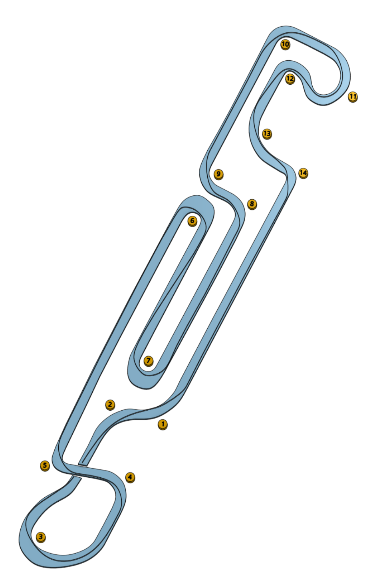

# PFI Grantham

British, European and World Championships are held at PFI, marking it as probably the most prestigious track we visit in the JLP Karting season. As at Ellough Park, you'll likely see trucks here that carry private karts. Visit the [track website here](https://www.kartpfi.com/).

## Club Etiquette

Please [click here](../Club_Eiquette) refresh yourself on club etiquette. As with the safety video, you should give the club etiquette a review before every race.

## Getting There

Plan your journey [here](https://www.google.com/maps/place/PF+International+Kart+Circuit/@53.037177,-0.6640537,15.25z/data=!4m9!1m2!2m1!1spfi+grantham!3m5!1s0x4878362d729a50f1:0x738a765849950a00!8m2!3d53.038887!4d-0.6599833!15sCgxwZmkgZ3JhbnRoYW1aDiIMcGZpIGdyYW50aGFtkgENZ29fa2FydF90cmFja5oBJENoZERTVWhOTUc5blMwVkpRMEZuU1VSeGEzSlFTV2huUlJBQg).

## Driving Line

Here's an example driving line:

## Video

Take a look at this [superb onboard lap](https://www.youtube.com/watch?v=lnAe_t2_m74) with commentary, produced by the FIA Karting Championship. Make no mistake, the hire karts won't perform like the one shown, with max speeds at around 45mph.

## Driving Tips

If you want to dive into more expert guidance, check out this [guide on Autosport.com](https://www.autosport.com/national/news/promoted-the-secrets-to-pf-international-5320513/5320513/)

## Club Records

| Weather | Beginner | Intermediate | Advanced |
|---      |---       |---           |---       |
| Dry     |  |  |  |
| Wet     | Paul Dunkley ( 1:35.239 - 2022 ) | George Shanley ( 1:36.919 - 2022 ) | Duncan Ford - ( 1:33.722 - 2022 )        |
