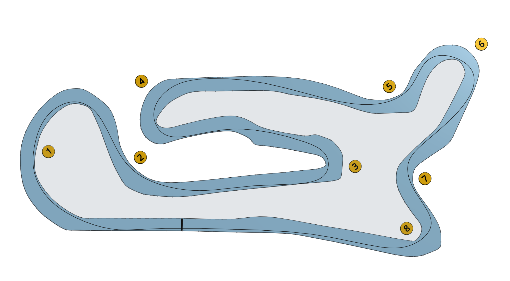

# Rye House

Rye House is one of the oldest in existence and over the years has hosted many national and international meetings. Visit the [track website here](https://www.rye-house.co.uk/).

## Club Etiquette

Please [click here](../Club_Eiquette) refresh yourself on club etiquette. As with the safety video, you should give the club etiquette a review before every race.

## Getting There

Plan your journey [here](https://www.google.com/maps/place/Rye+House+Kart+Raceway/@51.7675123,0.0115243,15z/data=!4m14!1m7!3m6!1s0x47d89dfd755f6bcb:0x68e250e8f76a21d5!2sRye+House+Kart+Raceway!8m2!3d51.7675123!4d0.0115243!16s%2Fm%2F03ct0lw!3m5!1s0x47d89dfd755f6bcb:0x68e250e8f76a21d5!8m2!3d51.7675123!4d0.0115243!16s%2Fm%2F03ct0lw?entry=ttu).

## Driving Line

Here's an example driving line:

## Video

There are quite a few good videos for Rye House. [This one](https://www.youtube.com/watch?v=yq_ejPWdLCA) also includes some great driving tips for this circuit.

## Driving Tips

Here's a [great guide in words](https://kclmotorsport.wordpress.com/2012/10/22/rye-house-track-guide/) to maybe add a bit more flavour to the above video guide.

## Club Records

| Weather | Beginner | Intermediate | Advanced |
|---      |---       |---           |---       |
| Dry     |  |  |  |
| Wet     |  |  |  |
