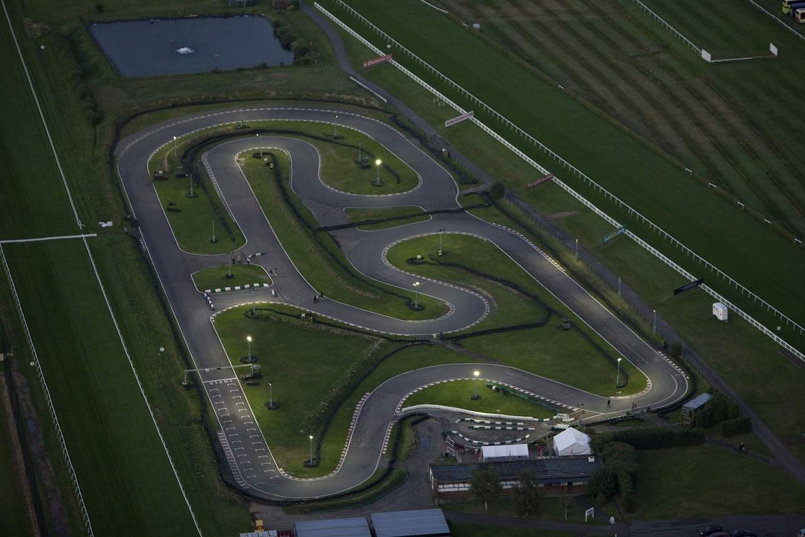
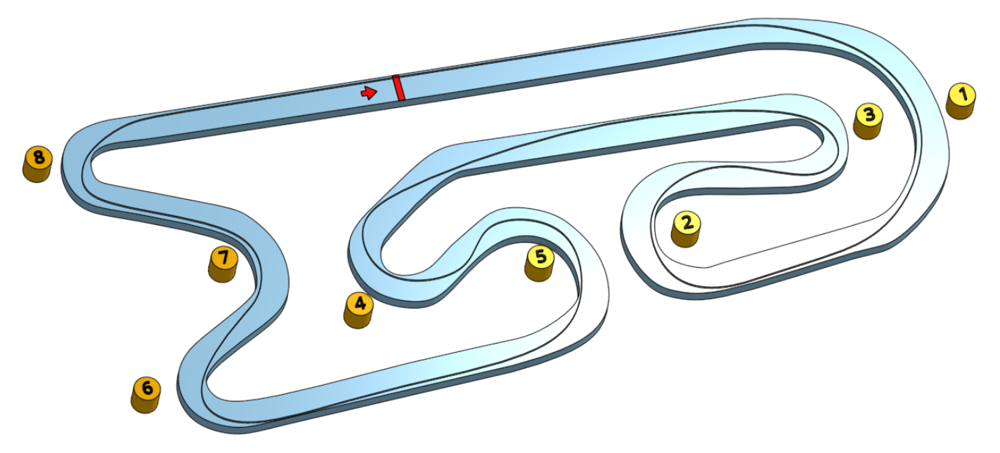

# Sandown Park

[Daytona - Sandown Park](https://www.daytona.co.uk/venues/sandown-park/) has been a regular stop for the Kart Club for years. We've raced both in the Sodi and [DMax](https://www.daytona.co.uk/venues/sandown-park/new-dmax-at-sandown-park/) karts, both sets of which were renewed during 2020. If it's going to be your first time in a DMax, be prepared to be travelling a lot faster than the more typical Sodi karts (sick bags are not provided by the club).

# Travel

Plan your journey [here](https://www.google.com/maps/place/Daytona+Outdoor+Go-Karting+%7C+Sandown+Park+(Surrey)/@51.375682,-0.36227,16z/data=!4m5!3m4!1s0x0:0x1ce709647848ebfb!8m2!3d51.375568!4d-0.3622234?hl=en-US).

# Driving Line

Here's an example of the driving line, distilled from a [circuit lap record video from 2020](https://www.youtube.com/watch?v=j4ctjRrNOho)

Of course, it's always possible they'll switcheroo us to the alternate layout. If so, [here's how that's going to look](https://www.youtube.com/watch?v=s6B0vZfkt8E).

## Tips (for a dry day)

## On-Board Video

GoPro's have been allowed here in the past. Double check in the What's App group for the race if you're not sure whether they'll be allowed during the next race. As we've raced here in the past with them, some on-board video links can be found below.

### 2021
Chris O - [F300 - 2018](https://www.youtube.com/watch?v=ewnHRUxuQKI)

Chris O - [DMax - 2016](https://www.youtube.com/watch?v=CX-Lg7b1rAA)

## Club Records

### Sodi
| Weather | Beginner | Intermediate | Advanced |
|---      |---       |---           |---       |
| Dry     | Mark Hopkins ( 52.062 - 2018 ) | Nic Honan ( 51.426 - 2018 ) | Andrea Skane ( 51.020 - 2018 ) |
| Wet     |          |              |          |

### DMax
| Weather | Beginner | Intermediate | Advanced |
|---      |---       |---           |---       |
| Dry     |          |              |          |
| Wet     |          |              |          |
