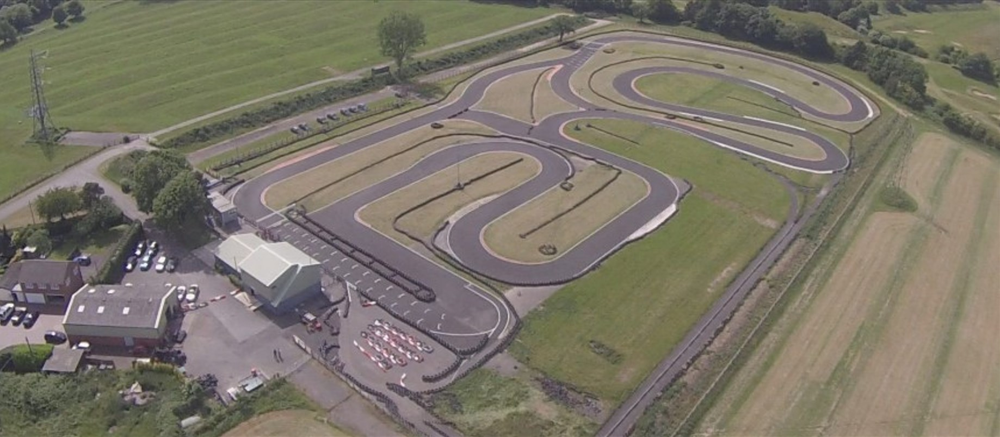

# Tamworth

Along with Sandown and Milton Keynes, Tamworth is run by Daytona. Visit the [track website here](https://www.daytona.co.uk/venues/tamworth/).

## Club Etiquette

Please [click here](../Club_Eiquette) refresh yourself on club etiquette. As with the safety video, you should give the club etiquette a review before every race.

## Getting There

Postcode - B78 1AR

Plan your journey [here](https://www.google.com/maps/place/Daytona+Outdoor+Go-Karting+%7C+Tamworth+(Midlands)/@52.621696,-1.640175,16z/data=!4m12!1m6!3m5!1s0x0:0x479ddfa54b45d2de!2sDaytona+Outdoor+Go-Karting+%7C+Tamworth+(Midlands)!8m2!3d52.621696!4d-1.640175!3m4!1s0x0:0x479ddfa54b45d2de!8m2!3d52.621696!4d-1.640175?hl=en-US).

## Driving Line

Here's an example driving line:

## Video

Chris Orritt recorded [this video lap](https://youtu.be/GqMK7hPNn08?list=PLsGK_pLZ_jZLwei_vmKZFLdSYDGD64vDA&t=456) during the 2016 season.

## Driving Tips

* Turn 1 is a 90 right that can be taken flat out, remain on the throttle down the straight through some very slight left and right curves, and then remain flat through the long curved right-hander after the alternate start line light gantry.
* The corner after this long straight has a marshall post on the right-hand side where a small lift/brake followed by a wide entry is the best line into the corner.
* Make sure you clip a late apex and stay on the throttle onto the large run-off(allowed to use this at the time of writing based on last visit here) on the exit of the corner. Don't stay on this runoff for long as you need to have the kart towards the middle of the track for a long sweeping left-hander...a slight lift is all that's required here so that you can hug the inside of the corner(avoid the kerb as it can unsettle the kart) and try to remain on the left-hand side upon exit to set you up for the next corner.
* The next sequence is pretty much a mirror of the last 2 as it is again a sweeping right and then sweeping left-hand corner. This time however there is no real reference point on the right-hander but again a slight lift is all that's needed before powering out of the right-hander. There's no exit curb this time and the left-hander is slightly tighter and again the exit here is to stay on the left as it is followed by a 90 right as we start to enter the last part of the circuit.
* This 90 right can be taken flat as it has a wide exit, stay left for the hairpin that follows using a slight lift again as it is a wide hairpin but upon exit, you'll be on the left and will need to quickly move to the right in order to deal with the next left hairpin again that can be dealt with by a small lift. 
* The last 2 corners are the hardest on the track. If you get these wrong and the person behind you nails it, you'll be under pressure for most of the next lap until you can get back to this tighter complex section.
* Stay right upon exiting the last hairpin and a slight dab of break before entering the 90 left, you can ride the kerb here but it will unsettle the kart and keep in mind as soon as you exit this corner you are in the braking zone for the last tight hairpin that is the end of the lap.
* Try to clip the apex of the hairpin but mind the tires and also any opportunistic lunges on the opening lap. The exit is deceptive as it looks like you have a lot of area to run wide but the tires soon narrow and so be careful as if you clip them you are scrubbing speed as you approach turn 1 and the fast sections again!

## Club Records

| Weather | Beginner | Intermediate | Advanced |
|---      |---       |---           |---       |
| Dry     | Phil Newport ( TBC - 2022 )         | Nic Honan ( TBC - 2022 )             | Jack Merry ( 59:574 - 2022 )         |