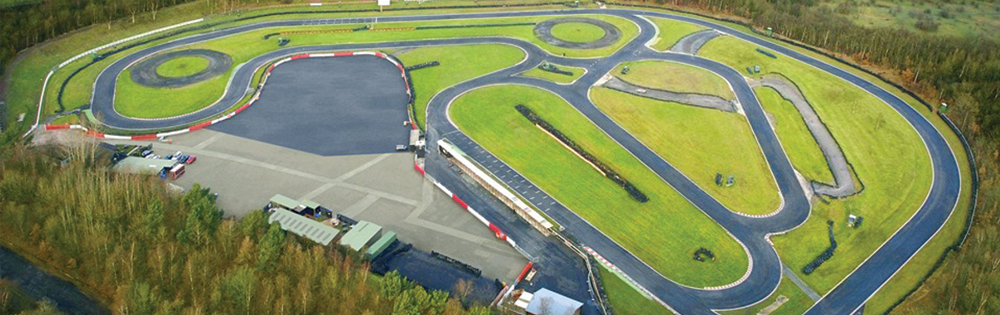
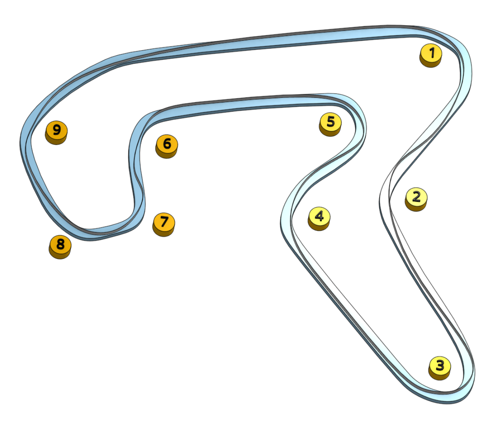

# Three Sisters

Three Sisters is a big track compared to usual karting fare. All manner of race events take place here. Visit the [track website here](https://threesisterscircuit.co.uk/).

## Club Etiquette

Please [click here](../Club_Eiquette) refresh yourself on club etiquette. As with the safety video, you should give the club etiquette a review before every race.

## Getting There

Postcode - WN4 8DD

Plan your journey [here](https://www.google.com/maps/place/Three+Sisters+Race+Circuit/@53.5060782,-2.6373671,17z/data=!4m12!1m6!3m5!1s0x487b05a6d8cee531:0x9cfa82ae14deb236!2sThree+Sisters+Race+Circuit!8m2!3d53.506075!4d-2.6351784!3m4!1s0x487b05a6d8cee531:0x9cfa82ae14deb236!8m2!3d53.506075!4d-2.6351784).

## Driving Line

Here's an example driving line:

## Video

Hop onboard for a lap [by clicking here](https://youtu.be/r4P6pCoj7ZM?t=373)

## Driving Tips

## Club Records

| Weather | Beginner | Intermediate | Advanced |
|---      |---       |---           |---       |
| Dry     | Phil Newport ( 51:856 - 2022 )         | Mark Hopkins ( 51:607 - 2022 )             | Daniel Skelton ( 50:573 - 2022 )         |