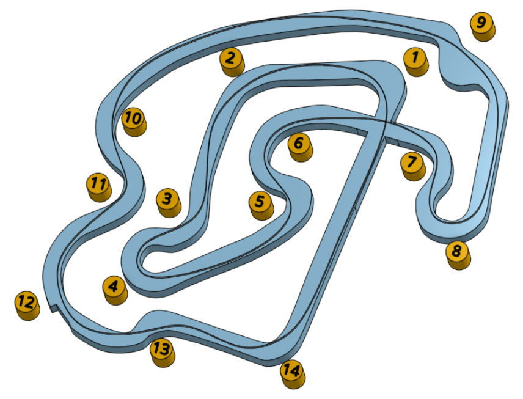

# Thruxton

Thruxton is gruelling circuit located in the south of England. Prepare to feel like you've had a proper workout after your session here. Visit the [track website here](https://www.thruxtonkarting.co.uk/).

## Getting There

Postcode - SP11 8PW

Plan your journey [here](https://www.google.co.uk/maps/place/Thruxton+Kart+Centre/@51.2032171,-1.6107885,388m/data=!3m1!1e3!4m9!1m2!2m1!1sThruxton+Karting!3m5!1s0x0:0x2d52474cad14edb2!8m2!3d51.203053!4d-1.609634!15sChBUaHJ1eHRvbiBLYXJ0aW5nWiQKEHRocnV4dG9uIGthcnRpbmciEHRocnV4dG9uIGthcnRpbmeSAQ1nb19rYXJ0X3RyYWNrmgEjQ2haRFNVaE5NRzluUzBWSlEwRm5TVU4zWDBsbFIxbFJFQUU).

## Driving Line

Here's an example driving line:

## Video

Also there's a [video](https://www.youtube.com/watch?v=Q8a-kOWFrq8) from many moons ago before they banned the use of GoPros here. That's right, you can leave that at home.

## Driving Tips

* With 14 turns, this is going to feel like a workout. Take advantage of the two long runs (turns 9 to 10 and then 14 to 1) to release your grip on the wheel and give your forearm muscles a breather.
* The fastest part of the circuit will be just before turn 10. Accellerating out of turn 8, you will probably find you don't need to brake for turn 9 once the tyres are warm.
* As in the video, and the last time the club visited Thruxton, the starting grid will likely be split by a series of cones; no overtaking until you exit the cones. They do this to prevent a mega pile-up on turn 1.
* Watch a couple of laps of the video to get a feel for the circuit.
* Use the run off on turn 1 to keep your momentum up.
* Turn 2 is pretty flat out, but line up corner 3 well and you'll be able to turn and accelerate through turn 4 which is very slow.
* Turn 5 is pretty tight with a barrier on the left. You want an angle in that will let you hug turn 6 which then takes you under the bridge.
* Get turn 6 right and you'll have an opportunity to pass slower drivers under the bridge, round turn 7 and into turn 8.
* Mistakes made at turn 8 will cost you all the way to your next application of the brakes. Don't understeer.
* Turn 10 is very fast, but work you way up to the speed you can handle here. You should be able to get through here pretty fast into turn 11, allowing the engine to brake you a little as you then come back onto the power for turn 12, which is possible flat out on warm tyres eventually.
* Get the entry to turn 14 right and you'll have been almost flat out from turn 11 through to turn 1, and then you're ready to do it all again.

## Club Records

### 900m Circuit
| Weather | Beginner | Intermediate | Advanced |
|---      |---       |---           |---       |
| Dry     |          |              |          |
| Wet     |          |              |          |

### 1100m Circuit
| Weather | Beginner | Intermediate | Advanced |
|---      |---       |---           |---       |
| Dry     |          |              |          |
| Damp    | Piero B ( 1:04:520 - 2021) | Mark Hopkins ( 1:03:529 - 2021 ) | Chris Taig ( 1:03:354 - 2021 )         |
| Wet     |          |              |          |
