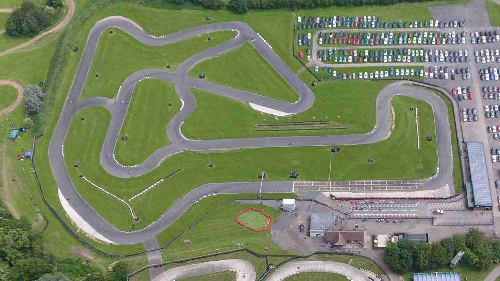
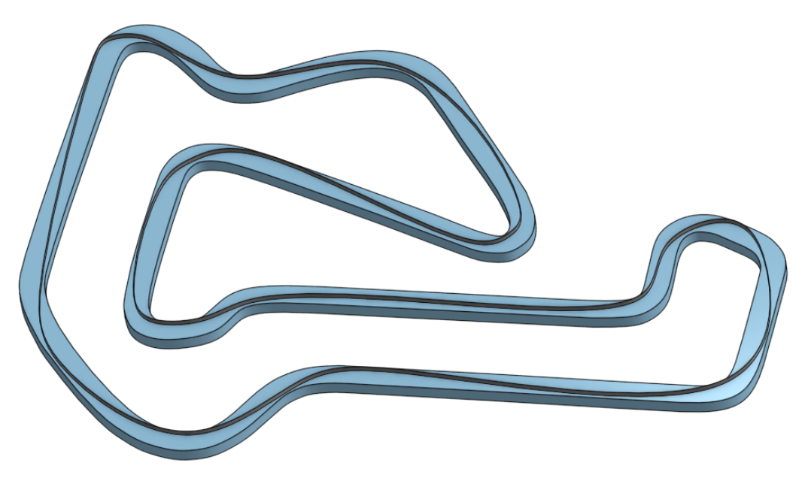

# Whilton Mill

Located just northwest of Northampton, Whilton Mill is one of the club's favourites and thus the choice for the <del>Rainbow</del> Super Cup. All qualified drivers battle head to head for a winner-takes-all finale to the season. The circuit is also popular with owner-drivers and part of the Club-100 circuit, and you'll find no end of YouTube videos of racing at this location.

## Club Etiquette

Please [click here](../Club_Eiquette) refresh yourself on club etiquette. As with the safety video, you should give the club etiquette a review before every race.

## Getting There

Postcode - NN11 2NH

Plan your journey [here](https://www.google.com/maps/place/Whilton+Mill+Karting+%26+Outdoor+Activities/@52.2747073,-1.0916684,17z/data=!4m13!1m7!3m6!1s0x4877141c39a0aabf:0x9c93d9c483f10ef7!2sWhilton+Mill,+Whilton+Locks,+Whilton,+Daventry+NN11+2NH!3b1!8m2!3d52.2747073!4d-1.0894797!3m4!1s0x4877141b639e4695:0x47d41a4446091c2a!8m2!3d52.2759513!4d-1.0891451).

## Driving Line

Here's an example driving line:

## Video

GoPros are allowed at Whilton. As a result you can indulge yourself in numerous trips around the circuit and even enjoy famous overtaking manoeuvres such as this popular [multi-million-views (it'll get there)](https://www.youtube.com/watch?v=lLOuIrwMlWw) example from Chris.

## Driving Tips

There's a super [video track driving guide here](https://www.youtube.com/watch?v=aenDbbbgKio). There's also a [Club 100 guide for you to digest](https://club100.co.uk/circuit-guide/whilton-mill-bite-size-track-guide/).

A word of warning though!. The owners of Whilton Mill are VERY keen on keeping their lease karts in good condition and as a result are highly likely to penalise you if you stray over kerbs.

REPEAT: CROSS THE KERBS AT YOUR PERIL.

Adjust what you learn from video appropriately. Perhaps the only thing you're likely to get away will be the [runoff area after the hairpin](https://youtu.be/aenDbbbgKio?t=233) but check on the day during the briefing if you're not sure rather than take anything for granted.

## Club Records

| Weather | Beginner | Intermediate | Advanced |
|---      |---       |---           |---       |
| Dry     | Mark Hopkins ( 58.725 - 2018 )         | Duncan Ford ( 57.889 - 2019 )             | Matt Clark ( 57.088 - 2018 )         |
| Damp    |          |
| Wet     |          |              |          |
